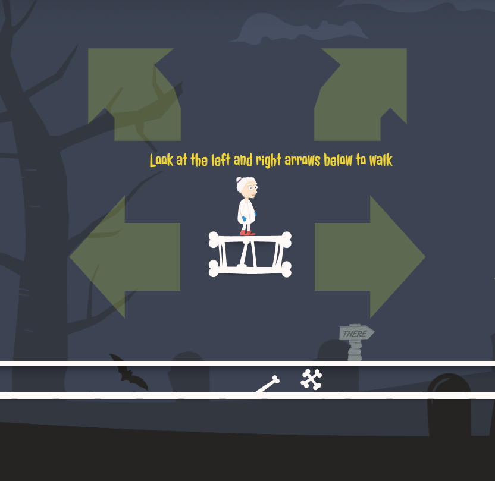

## Heal'em All: An eye gaze platform game

Back in 2013, Kris Urbas and Paweł Madeja made a lovely little platform game which was one of the winners of that year's Github Game Off game jam. Here at SpecialEffect in 2019 we discovered the game and wanted to give it a new lease of life and share it with an under-served audience - disabled gamers who use eye gaze to access a computer. We reached out to Kris and Paweł, who kindly agreed we could take their code and modify it for our users.

## The game

In the game you are a pioneering doctor who has discovered a cure for the zombie plague. You must explore an old, abandoned graveyard, heal as many zombies as you can, and find your way out safely. You can play the game using eye gaze, mouse or touch control. 

You control the player by looking at arrows on the screen. You can dwell or click on 'jump' arrows to automatically jump in either direction. These gaze controls are adjustable if you need them to be larger or smaller. There are also several settings you can change to adjust the game to your preferences, including easier game modes.

## Eye tracker support

The game runs in a web browser (tested primarily with Chrome), and uses the cursor as input. Any eye tracker that you can use to directly control the cursor will be compatible. If you don't like seeing the cursor jump around while you're controlling it with your eyes, you can hide it within the game. This way it won't feel like you're using direct pointer control.

## Game options

Accessibility is often about providing a range of options so players with various needs can adjust the game to their requirements. In heal-em-all, we have added settings to support
- different difficulty levels (basic presets, or custom control over different options)
- different input methods (keyboard, touch, gaze - and different gaze options)
- music, sound effects
- game narration is available

## Acknowledgements 

Thanks to Kris and Paweł for creating the original game!
-   [Kris Urbas](https://twitter.com/krzysu) - programming, story
-   [Pawel Madeja](https://twitter.com/pawelmadeja) - graphics

Thanks to authors of these open source licenses which are used in the game
-   [Quintus JavaScript game engine](http://html5quintus.com/) is used under the MIT license
-   [grunt.js](http://gruntjs.com/) is used under the MIT license

Audio downloaded from [OpenGameArt](http://opengameart.org/)

## Licensing

### Code

All source code is distributed under the [GPLv3 license](LICENSE).  
Original copyright (c) 2013 Krzysztof Urbas (@krzysu) and Paweł Madeja (@pawelmadeja). 
Modifications (c) 2019 Kirsty McNaught 

## Assets

All art assets (files in ``app/images/``) are distributed under the [Creative Commons Attribution 4.0 International](http://creativecommons.org/licenses/by/4.0/) license.  
Original artist: Paweł Madeja
Some modifications / additions: Kirsty McNaught

